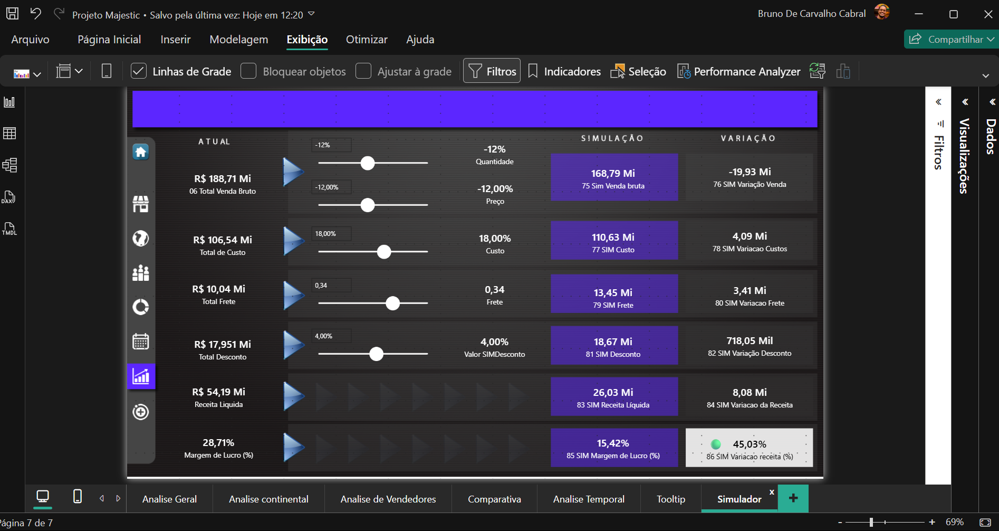

# Portfolio-powerbi
# 📊 Dashboard Comercial — Majestic Exportadora

## 📌 Objetivo do Projeto

Este projeto foi desenvolvido com foco em análise comercial e acompanhamento de desempenho gerencial utilizando Power BI.

O dashboard permite visualizar metas, indicadores de performance e evolução dos resultados ao longo do período analisado, proporcionando uma visão estratégica para apoio na tomada de decisão.

---

## 🚀 Ferramentas Utilizadas

- Power BI
- DAX
- Excel
- Modelagem de Dados
- Storytelling com Dados

---

## 📈 Indicadores Analisados

- Meta vs Realizado
- Evolução mensal
- Performance por gerência
- KPIs comerciais
- Indicadores estratégicos
- Tooltips interativos

---

## 🎯 Principais Aprendizados

Durante o desenvolvimento deste projeto foram praticados conceitos importantes como:

- Criação de medidas DAX
- Tratamento de dados
- Construção de dashboards interativos
- Navegação entre páginas
- Desenvolvimento de KPIs
- Experiência do usuário com tooltips personalizados

---

## 🖼️ Dashboard

### Visão Geral

## 🖼️ Dashboard

### 📌 Visão Geral

---

### 🌍 Análise Continental

---

### 👨‍💼 Análise de Vendedores

---

### 📊 Comparativo Ano Atual vs Ano Anterior

---

### ⏳ Análise Temporal

---

### 🎯 Tooltip Interativo

---

### 🧮 Simulação de Cenários

---

## 👨‍💻 Autor

Bruno Cabral  
Profissional em transição para a área de Dados, com experiência em logística, indicadores operacionais e análise de performance.

🔗 LinkedIn:
(coloque seu linkedin aqui)
